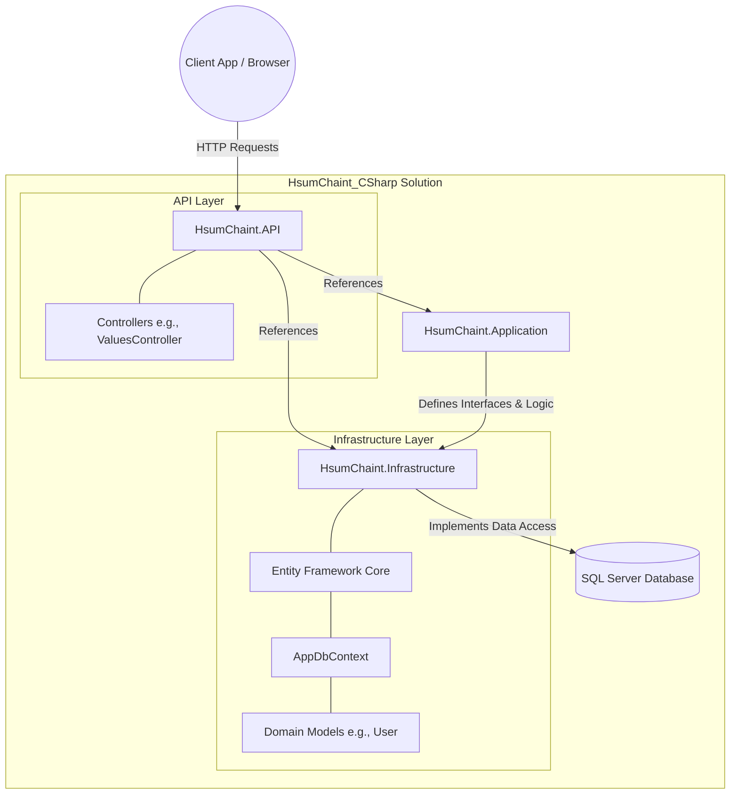

# HsumChaint C# Project Overview

This documentation provides a high-level overview of the `HsumChaint_CSharp` project and its architectural structure. 

## Architecture Overview

The solution follows a structured, layered architectural pattern consisting of three main projects:

### 1. **HsumChaint.API**
This is the entry point for the application. It's a web API project built on ASP.NET Core that hosts the endpoints for the system.
- **Controllers**: Responsible for receiving HTTP requests, forwarding them to the appropriate application logic, and returning responses. (e.g., `ValuesController.cs`).
- **Configuration**: Contains `Program.cs` and `appsettings.json` configuring middleware, services, injection scopes, and standard web hosting structures.

### 2. **HsumChaint.Application**
The application layer typically handles business logic, service interfaces, data transfer objects (DTOs), and potentially CQRS patterns (Commands/Queries/Handlers). It acts as the orchestrator between the API layer and the Infrastructure/Domain layer.

### 3. **HsumChaint.Infrastructure**
The infrastructure layer is responsible for external dependency implementation. Primarily, it contains the data access components relying on Entity Framework Core.
- **Database Context**: Contains `AppDbContext` (`Context/AppDbContext.cs`), configured to connect to a SQL Server database.
- **Entities / Models**: Currently incorporates the `User` domain model (with properties like `ID`, `PhoneNumber`, `CreatedAt`, `UpdatedAt`) which maps to the `User` table in the database.
- **Scaffolding**: The models and contexts appear to be initially generated via an EF Core scaffold script (`dotnet ef dbcontext scaffold`) derived from an existing database schema, as per the references in the `README.md`.

## Data Model snapshot

The central entity mapped in the `AppDbContext` so far is `User`, defined broadly as:
- **`ID`**: The primary key
- **`PhoneNumber`**: Sized to a maximum length of 50 characters.
- **`CreatedAt`** / **`UpdatedAt`**: Standard audit fields mapped to a SQL Server `datetime` type.

## Project Architecture Flow

